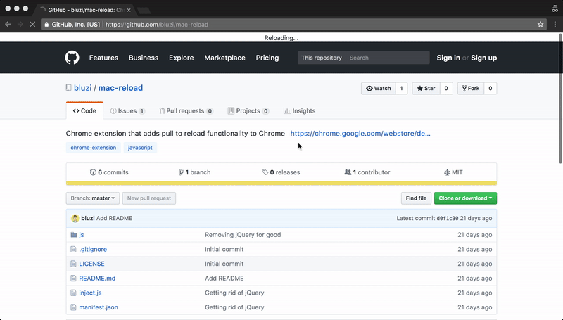

# Mac Reload
*Mac Reload* is an extension for Google Chrome running on macOS which adds a pull to reload functionallity. It is free, lightweight and fully open source.

## Prieview

## Technologies
*Mac Reload* is built using vanilla JavaScript (no heavy third party libraries such as jQuery or Lodash used) with only one dependency being [Overscroll](https://github.com/bluzi/overscroll)

## Installation
You may install *Mac Reload* from the extensions store, using the following link: https://chrome.google.com/webstore/detail/mac-reload/jmjbompggjpodbaehpndnodaglngeoba

## Contribution
We accept any kind of contribution :) 